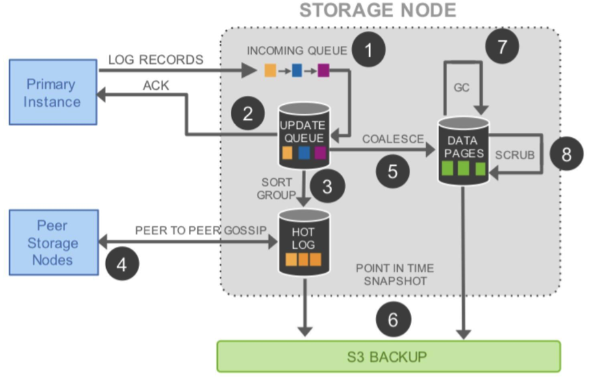

## What it is?
- Relational database service, not NOSQL
- Focus on OLTP
- The [NewSQL](https://en.wikipedia.org/wiki/NewSQL)

**What is the overall big change?**
- Storage as in independent fault-tolerant and self-healing service
- Only write redo log records to storage
    - Reduce network IOPs
    - Off-load work to storage and enable more performance optimization
- Move one-time expensive operations (backup and redo recovery etc.) to continuous asynchronous operation

## What problems it tries to resolve?
- Assumption & Issues:
    - Bottleneck for high throughput data processing: from compute and storage to Network
        - Basic bottlenecks: packets per second (PPS), bandwidth
        - Amplification of traffic: fans out in parallel for writing
    - Other issues impacting performance
        - Operations in a database causes stalls and context switches, such as cache miss (mutiple reads, checkpointing, dirty page writing etc.)
        - Transaction stall commits slowdown others when using multi-phase synchronization protocols, such as 2PC

- Challenges:
    - Network will be the bottleneck?
    - How does it handle the complex and correlated failures? -- Quorum models?
    - How it handle consistency?

## How it works?

The major part is aggressively leveraging the redo log for the storage and traffic optimization.

1. Separate compute from storage (like other modern distributed cloud service)
    - Move logging and storage off the database engine
    - Virtualized segmented redo log and loosely couple to database instances
        - Storage instance still includes most of the components of a traditional kernel
            - Query processor
            - Transactions
            - Locking
            - Buffer cache
            - Undo management etc.
        - Other functions
            - Redo logging
            - Durable storage
            - Crash recovery
            - Backup/restore etc.
    - Database Engine
        - Focus on the management
        - Distribute traffic
2. Durablility at scale
    1. Replications
        - Common approach to tolerate failures in replicated system: Quorum-based voting protocol, which must obey two rules:
            1. Each read must be aware of the most recent write, frmulated as V_r + V_w > V, where V is the copies.
            2. Each write must be aware of teh most write to avoid conflicting writes, formulated as V_w > V/2
        - Design points
            - Principles
                1. Lose an entire Availabilty Zone (AZ) and on additioanl node (AZ + 1) without losing data
                2. Lose an entire AZ without impacting the ability to write data
            - How?
                - 6 replications, across 3 AZs with 2 copies each AZ
                - Write quorum (4), read quorum (3)
    2. Segmented Storage
        - Database volume partitioned into small fixed size segments, 10GB each
        - Protection Groups (PGs) consists of 6 10GB segments (6 replications), across 3 AZs, 2 each AZ
        - A storage volume is concatenated set of PGs virtually, physically stored by a bunch of storage nodes. Volume up to 64 TB on an unreplicated basis (10GB minimum, at least one segment).
            - How many volumes could a database have? - One virtual volume to storage one database
    3. Operational advantages of resilience
        - High resilience design allows very easy for the maintenance works, such as heat management, OS and security patching, software upgrades etc.
3. **Log is the database**
    - Database write amplification issues
        - Typical types data need to write: 
            - Redo log 
            - Binary (statement) log
            - Modified data pages
            - Second temporary write of data page (double-write) to prevent torn pages
            - Metadata (FRM) files
        - Issues
            - Write (network) IOs amplification
            - Write operations occur in both primary and standby instances
            - Synchronous block-level mirroring to standby instances
    - Offloading Redo Processing to Storage (solution)
        - Traditioanl database modify data page:
            - Generate a redo log record
            - Then invoke a log applicator apply the redo log to in-memory before-image of the page and produce its after image
        - How it works in Aurora
            - Only writes the redo log records across the network
            - Log applicator is pushed to the storage tier
                - Database tier
                    - No pages written
                    - No background writes
                    - No checkpointing
                    - No cache eviction
                - How does the storage tier be aware of the changes?
            - Primary instance
                - Only writes log records on storage service
                - Stream log records as well as metadata updates to replica instances
                - IO flow batches ordered log records based on common destination (a logical segment, i.e., a PG) and delivers each batch to all 6 replicas
                    - The batch persisted on disk in replicas and database engine waits for ack from 4 out of 6
                    - Replicas use the redo log records to apply changes to their buffer caches, continuously, asynchronously
4. Storage Service Design Points
    - Goal: minimize the latency of the foreground write requst
        - By moving majority of storage processing to the background
            - Potential optimization: schedule the background job based on the traffic status
    - IO traffic in Aurora Storage Nodes

 (from Aurora paper)

5. **How to Leverage Logs to implement consistency?**
- Asynchronous Processing
    - Each log record has one Log Sequence Number (LSN), monotonically increasing value generated by database
    - Logic for tracking partially completed transactions and undoing them is kept in the database engine, just as if it were writing to simple disks
        - Upon restart the storage service does its own recovery (focus not on user-level transactions), making sure database see a uniform view of storage
        - Storage service determines highest LSN which guarantee availability of all prior log records (Volume Complete LSN, VCL)
            - During recovery, LSN larger than VCL will be truncated
            - Database can constrains subset of points for truncation by tagging log records, as Consistency Point LSNs (CPLs). This could implement the transaction complete.
            - Volume Durable LSN (VDL) uses the highest CPL that is smaller than or equal to VCL, and truncate all log records with LSN greater than VDL
    - Database interact with storage:
        - Each database-level transaction broken into multiple mini-trasactions (MRTs) which are ordered and must be performed atomically
        - Each mini-transaction composed of mutiple contiguous log records
        - Final log recod in a mini-trasaction is a CPL
- Normal Operations
    - Writes
        - Database allocates a unique ordered LSN for each log record, there is a constant call LSN Allocation Limit (LAL) (set to 10 million), kind of back-pressure for storage system
        - Each segment of each PG only sees a subset of log records
        - Each log record contains a backlink t the previous log record
            - Used to track the point of completeness, establish Segment Complete LSN (SCL). SCL is used by storage nodes to gossip exchange the log records
    - Reads
        - Page served from buffer cache, and do storage IO request if page in question is misssing in cache
        - If buffer cache is full, find victtim page to evict from the cache - page in buffer cache always be the latest version
            - Evicting page from cache if "page LSN" greater or equal to VDL
        - Database can compute at any time the Minimum Read Point LSN on a per-PG basis, and then gossips across all nodes and have the Protection Group Min Read Point LSN (PGMRPL) as the "low water mark", below which the log records could be GC. 
    - Commits
        - Asynchronously, sets the transaction aside by recording its "commit LSN" as part of a separate list of transactions waiting on commit and move on other works, like WAL protocol. If the VDL >= commit LSN, database uses a dedicated thread to send commit ack back to clients
    - Replicas
        - Up to 15 read replicas
        - Rules
            - Only apply the log records with LSN less or equal to VDL
            - Log records that are part of a single mini-transaction are applied atomically in the replica's cache
- Recovery
    - Once database starts up, it performs volume recovery in collaboration with storage service, storage service take care of the redo log application incrementally, asynchronously
    - Database needs to reestablish the runtime state by
        - Contact each PG to calculate the read quorum for every PG
        - Then it could recalculate the VDL

## Existing works:
- Decoupling storage from compute
- Distributed Systems
- Concurrency Control
- Log-structured storage
- Recovery

## References
* [Amazon Aurora: Design Considerations for High Throughput Cloud-Native Relational Databases](https://www.allthingsdistributed.com/files/p1041-verbitski.pdf)
* [Amazon Aurora](https://www.slideshare.net/AmazonWebServices/amazon-aurora-119493615)